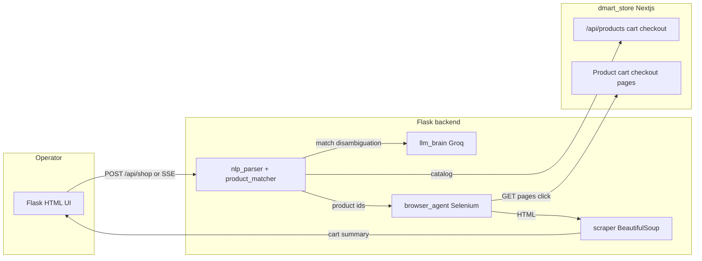

# Notes: architecture and design

This document describes how the **DMart agentic shopper** is put together, why the main dependencies were chosen, and how data flows through the system. It is meant to sit beside [backend/README.md](backend/README.md) for run instructions.

---

## System overview

The project is split into two cooperating applications:

1. **dmart-store** — A [Next.js](https://nextjs.org/) 15 + React 19 + TypeScript app that simulates a grocery storefront: product catalog, client-side cart, and checkout UI. It exposes HTTP APIs the agent relies on.
2. **backend** — A [Flask](https://flask.palletsprojects.com/) Python app that provides the operator UI, orchestrates a **parse → match → act** pipeline, calls **Groq** where reasoning is needed, and drives a real browser with **Selenium** against the same store the user can open manually.

Selenium is pointed at the store’s base URL (`DMART_BASE_URL`, default `http://127.0.0.1:3000`). The backend typically listens on **5001** to avoid clashing with tools that use **8501** (for example Streamlit) or **3000** (the Next dev server).

---

## Why these libraries (backend)

| Library | Role | Rationale |
|--------|------|-----------|
| **Flask** | HTTP server, templates, JSON APIs, **Server-Sent Events (SSE)** for streaming steps | Small surface area, easy to wire a single-page-style UI to progressive JSON events. SSE fits “one step at a time” without WebSocket infrastructure. |
| **groq** | Groq’s OpenAI-compatible API for chat and vision | Fast inference, simple Python client; good fit for disambiguation, summary, and optional vision on shopping-list photos. API keys and models are environment-driven. |
| **Selenium 4** | Control Chrome: open product URLs, set quantity, add to cart, open cart, checkout | The store is a real web app. Driving the same DOM a human uses avoids building a second “headless” integration path. |
| **webdriver-manager** | Download / cache matching ChromeDriver | Removes manual driver installation; keeps the hackathon project runnable across machines. |
| **BeautifulSoup4** | Parse **HTML** returned by the browser (cart and checkout) | The pipeline already has full page source from Selenium. HTML parsing is simpler and more debuggable than pushing JSON out of the browser for every step, while still using stable `data-*` hooks from the store. |
| **spaCy** (`en_core_web_sm`) | Optional linguistic cleanup in natural-language grocery list parsing | Improves robustness on free-form “add 2 milks and bread” phrasing. The parser is written to **degrade** if the model is missing. |
| **requests** | Fetch catalog JSON from the store’s `/api/products` | Straightforward, synchronous HTTP for a single catalog pull per run. |
| **python-dotenv** | Load `.env` for API keys, URLs, and Selenium options | Standard practice so secrets and environment-specific settings stay out of code. |
| **difflib** (stdlib) | `SequenceMatcher` in product ranking | **No extra dependency** for fuzzy string similarity; combined with heuristics and product ratings in `product_matcher.py`. |

### Why not an LLM for everything?

The design intentionally **limits** where the model runs:

- **Deterministic** steps: list parsing (regex + optional spaCy), catalog fetch, fuzzy matching, and browser actions. These should be **repeatable** and **debuggable** for a demo and for cost control.
- **LLM** steps: disambiguation among close catalog candidates, suggestions when there is no match, speech transcript structuring, vision on photos, and a short **cart summary**. These need language understanding or vision.

That split keeps behavior predictable and reduces unnecessary API calls.

---

## Why these choices (dmart-store)

| Choice | Rationale |
|--------|-----------|
| **Next.js 15 (App Router)** | File-based routes, API routes for cart/products/checkout, and server/client components; familiar stack for a storefront demo. |
| **React 19** | Default pairing with the Next version in this repo; used for the cart and product UIs. |
| **TypeScript** | Safer refactors of API payloads and cart types. |
| **Tailwind CSS 4** | Utility-first styling for rapid UI work (see the store’s own layout and components). |

The store and agent are **separate processes** on purpose: you can test the store in a normal browser, inspect network calls, and run the agent against the same origin Selenium uses.

---

## Module map (backend)

| Module | Responsibility |
|--------|----------------|
| [backend/app.py](backend/app.py) | Flask routes, `stream_shopping_request` generator, wiring of all stages, static screenshot URLs. |
| [backend/config.py](backend/config.py) | Central env: `GROQ_*`, `DMART_BASE_URL`, `SELENIUM_HEADLESS`, paths for static/screenshots. |
| [backend/nlp_parser.py](backend/nlp_parser.py) | Turn user text into structured line items (quantities and names). |
| [backend/product_matcher.py](backend/product_matcher.py) | Load catalog, score names with fuzzy + token overlap + rating, bucket into exact / ambiguous / not found. |
| [backend/llm_brain.py](backend/llm_brain.py) | Groq: disambiguation, suggestions, cart summary, speech parsing, image list extraction. |
| [backend/browser_agent.py](backend/browser_agent.py) | One shared Chrome instance: `add_to_cart`, `view_cart`, `checkout`, screenshots; includes **stale session** recovery (invalid Selenium session → reset driver, retry). |
| [backend/scraper.py](backend/scraper.py) | Convert cart/checkout HTML to structured `items`, subtotals, savings when `data-*` attributes are present. |

---

## Request lifecycle (one shopping run)

1. **Input** — User message (and optional photo/speech from the UI) becomes a list of requested items and optional “checkout” intent from phrasing.
2. **Match** — Each line is scored against the live catalog. High confidence → exact; multiple close matches → ambiguous; no signal → not found.
3. **LLM assist** — Ambiguous lines get a **disambiguation** call; not-found lines get **suggestions**; optional speech/photo path uses `llm_brain` early in the flow.
4. **Browser** — For each resolved product, Selenium opens the product page, sets quantity, adds to cart. **View cart** and **checkout** use the same session so cart state is consistent. If Chrome drops the session, the agent recreates the driver and retries the operation.
5. **Scrape** — Page HTML is parsed for cart lines, prices, and savings; a final **summary** can call the LLM again for a readable recap.
6. **Stream** — Each stage yields a JSON object; the UI consumes **SSE** from `/api/shop/stream` to render steps and screenshots as they complete.

---

## Configuration touchpoints

- **`.env` in `backend/`** (see [backend/.env.example](backend/.env.example)) — `GROQ_API_KEY`, model IDs, `DMART_BASE_URL`, `SELENIUM_HEADLESS`, `FLASK_PORT`, etc.
- **Store must be up** when matching or automating, because the catalog and pages are live HTTP targets.

---

## Files worth reading next

- [backend/README.md](backend/README.md) — install, `spacy` model download, and run commands.
- [dmart-store](dmart-store/) — `app/api/*` for the contract the matcher and browser assume; product and cart pages for `data-*` attributes `scraper.py` and `browser_agent.py` depend on.

If this document and the code diverge, **trust the code** and update this file when behavior or dependencies change.
